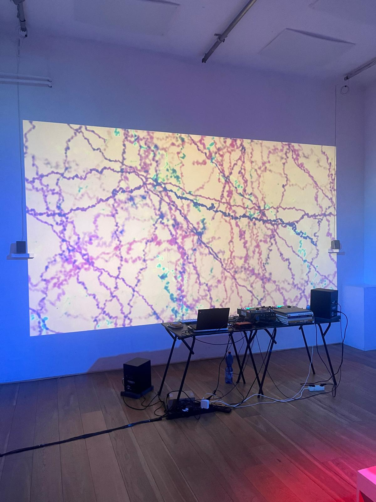
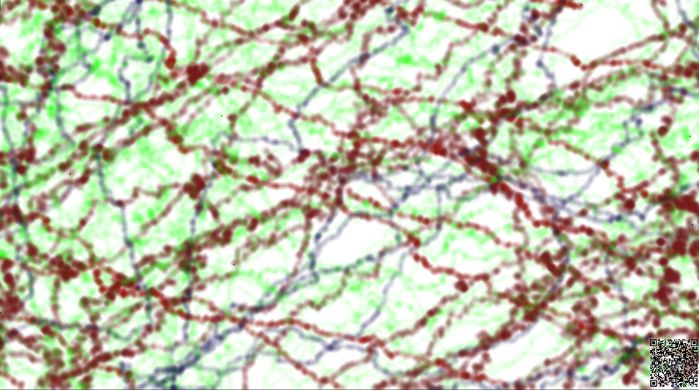

<!--blog.created_on="2024-8-10"-->
# Living Space

A simulation of a small ecosystem where creatures (pixels) interact with each other and their environment. Each creature has a unique personality based on the Big Five personality traits that influences how they walk and interact with other creatures. For example a very caring creature gets very attracted to other creatures or a more introverted creature will avoid other creatures and stay more in place.

The idea is that over time you will have a living colorful ecosystem that will change and adapt over time all based on the initial creatures you create. Resembling the way our society works and interacts with each other. 

**You can create your own canvas here:**
<!-- TODO: add query params to local links  -->
- [With QR](../living_space.md)
- [Without QR](https://lyrx.dev/living_space/?QR=false)
- [With debug information](http://lyrx.dev/living_space/?DEBUG_INFO=true)

You can generate new pixels by pressing the qr or scanning it. You can also generate random ones by pressing the canvas with your mouse.

Having the qr allows for you to add it on a display and keep it running while visitors can add new pixels to the screen.

<carousel>

</carousel>
