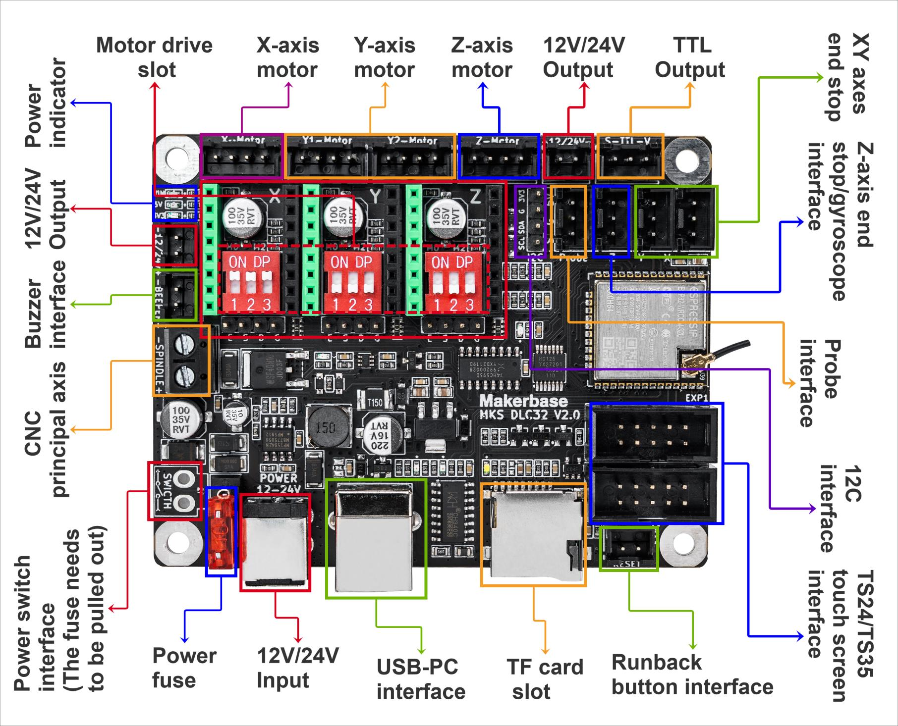
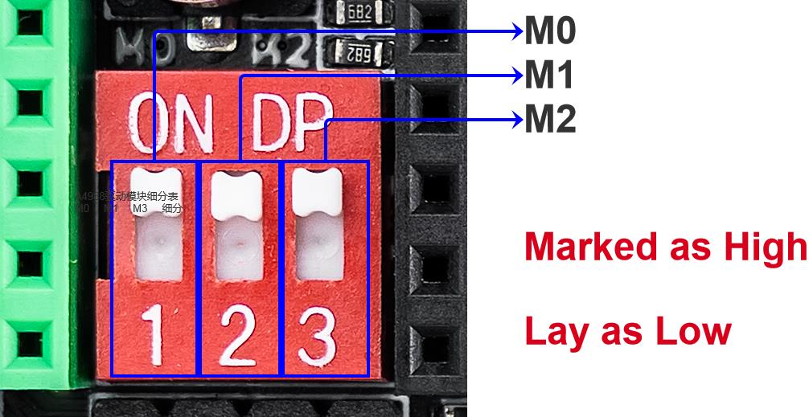
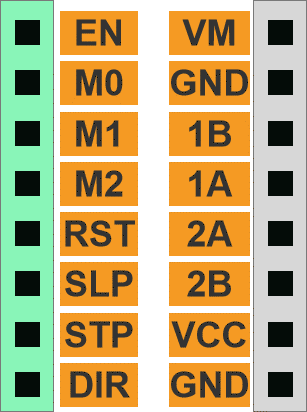
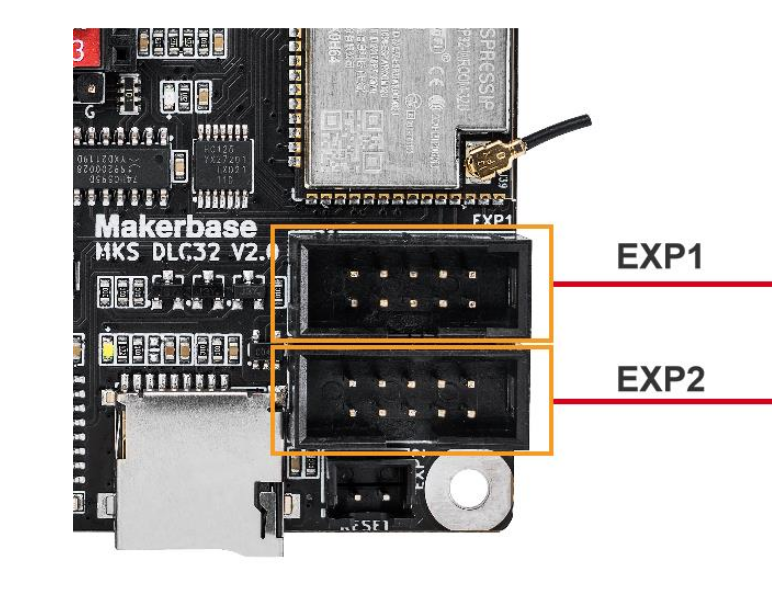
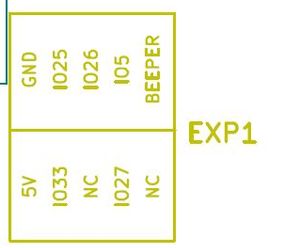
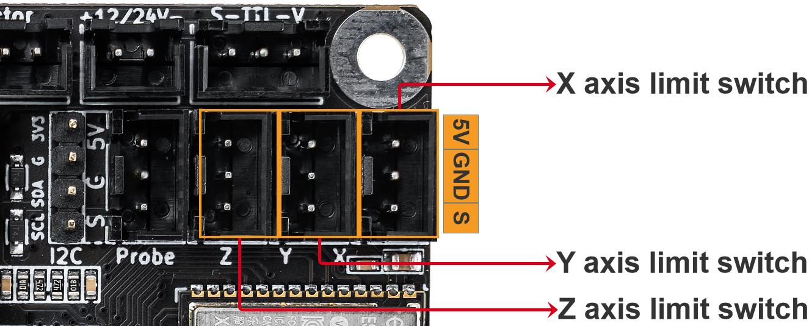

<!--
[post]
created_on="2026-7-9"
-->

# LastDraw: How to build a plotter

**LastDraw**, a play on the [NextDraw from bantam tools](https://bantamtools.com/collections/bantam-tools-nextdraw) is an updated version of a widely built plotter called [Drawing Robot](https://www.thingiverse.com/thing:2349232). It aims to use modern hardware and firmware to drive the plotter. It uses [CoreXY](https://corexy.com/theory.html) mechanics to move the end effector to any destination.

## Requirements 

### Equipment
- 3d Printer
- Soldering iron

### Part list
- TODO: x Amount of PLA

**Hardware**
- (2) Linear Rod M8 x 450mm, X Axis  
  https://www.amazon.com/dp/B07DPHDMDT
- (2) Linear Rod M8 x 350mm, Y Axis   
  https://www.amazon.com/dp/B07JKTLFD7
- (2) Linear Rod M3 x 90-120mm, Z Axis  
  Many old CDROM players have linear rods of these specs so you could salvage from an existing CDROM  
  https://aliexpress.com/item/1005003040410825.html  
- (1) Threaded Rod M8 x 480mm
- (8) LM8UU Bearings  
  https://www.amazon.com/uxcell-Bushing-Linear-Motion-Double/dp/B00X9H22SO
- (1-2) Springs (from ball point pen)  
  Choose one or two springs depending on how much force you want to apply to the drawing surface.
- (2) GT2 Pulley, 16-tooth  
  https://www.amazon.com/Anet-Timing-Pulley-Aluminum-Printer/dp/B07D294B2T
- (5) Bearing 624zz  
  https://www.amazon.com/uxcell-Bearing-4x13x5mm-Shielded-Bearings/dp/B07PLC6GY3Parts
- (1) 2000mm GT2 belt  
  https://www.amazon.com/Mercurry-Meters-timing-Rostock-GT2-6mm/dp/B071K8HYB4
- (4m+) 24 AWG wire  
  Stranded silicon wires are recommended because they are less prone to cracking with frequent movement   
  https://aliexpress.com/item/1005005450660428.html
- (10, 6 optional) Female breadboard wire ends
- (10, 6 optional) Heatshrinks for the breadboard wires

**Electronics**
- Nema 17 Stepper Motors  
  https://www.amazon.com/Stepper-Motor-Bipolar-64oz-Printer/dp/B00PNEQI7W
- (1) Servo Sg90  
  MG90S is an improvement over the original SG90, using metal gears.
  https://aliexpress.com/item/1005006219266362.html
- (1) Makerbase MKS DLC32  
  https://aliexpress.com/item/1005003183498253.html
- (2) A4988 Stepper Drivers
- (1) 12V 2A Power Supply  
  https://www.amazon.com/Adapter-100-240V-Transformers-Switching-Adaptor/dp/B019Q3U72M
- (1) 12V Fan 40mm x 40mm (optional but recommended)
- (1) Buck converter 12V - 5V 1A+
  https://aliexpress.com/item/1005010676734778.html
- (2) Limit switches (optional)  
  https://www.amazon.com/URBESTAC-Momentary-Hinge-Roller-Switches/dp/B00MFRMFS6
- (1) Switch SS-22 (optional) 10.6mm x 16mm
- (1) Tactile button (optional) 11.6 x 11.6

**Nuts**
TODO make sure count is okay, added +1 for m3, add count of case
- (8) M3
- (5) M4
- (4) M8

**Screws**
TODO make sure count is okay, added +1 for m3 16mm
- (14) M3 x 16mm
- (4) M3 x 6mm
- (5) M4 x 35mm
- (1) Hex M3 x 20mm  
  or another screw that fits in the 3d printed idler pulley.

**Washers**
- (4) M3 washer
- (4) M8 washer

## 3D Printing

You can download all parts here TODO INSERT. Or go to [thingiverse](TODO). I've printed all my parts on the Bambu P1S. I'm sharing my exact settings I've used to print the parts in the 3mf files.

## Assembly

TODO add pictures

### Assemble the x-axis bearings

- Take the **(2) 450mm linear rods** and insert them into either x-support part.
You may need to use a round file to smooth out the holes that you insert them in.
Also, you can use a rubber mallet to help insert the rods. 
- Take the **threaded rod** and insert it in the hole below. Feed a 8M washer
and 8M nut on both sides of the x-support part.
- Now you want to push the **LM8UU bearings** into their place on the top and bottom clamshell
The top and bottom clamshell take **(4)** bearings **each**
- Take **(4) 624zz bearings** and push them through the 3D printed idler pulleys. Leave the 5th bearing for later when
you assemble the Y-axis

### Assemble the x-axis carriage

- Get **(4) M3-0.5 x 20mm screws**, **(4) M3 nuts**, **(4) M3 washers** and **(4) 624zz bearings** with the idler pulleys installed on them.
- Take one screw and feed a washer through it, the washer will rest on the bearing. The nut will be at the bottom of
the carriage, which will secure the bearing in place.

### Assemble the x-axis support
- Slide the clamshell through the **450mm(X-axis) linear rods**
Use a rubber mallet again to attach the last X-support on the linear rods
  - Make sure that the rods stick out equally on both sides
  - Slide the other end of the **threaded rod** through the hole on the X-support
- Put on the last set of **nuts and washers** to hold the X-support in place
- Now that the X-axis is complete, you can use **(2) Phillips M3-0.5 x 16mm screws** per X-support to help keep the
linear rods from sliding

### Assemble the x-axis stepper motors
- Use an appropriate sized allen wrench to attach the **16 teeth pulleys** on the stepper motor shafts
- Flipping the entire chassis around will make it easier to attach the stepper motors
- Use **(8) M3-0.5 x 6mm screws** and a Phillips screwdriver to attach the **(2) stepper motors**

### Assemble the y-axis stepper clamshell
- Grab **(4) M4-0.5 x 35mm screws** and **(4) M4 nuts**
- Insert the **washers** in between the two clamshells, with a screw in between
- Screw the top and bottom clamshells together

### Assemble the y-axis back
- Take the **(2) 350mm linear rods** and insert them the Y-back piece by using a rubber mallet
- Get **(1) M4-0.5 x 35 screw**, **(1) M4 nut** and the **5th 624zz bearing**
- Get **(2) M3-0.5 x 16 screws** to secure the linear rods
- Slide in the **bearing** when inserting the screw through the Y-back piece

### Assemble the y-axis front
- Slide the the linear rods/Y-back piece through the **LM8UU bearings** and attach the Y-front piece using a rubber mallet

### Assemble the y-axis belt
- Use a pair of needle nose pliers to help guide the **GT2 belt** more easily through the clamshell
- Take the two ends of the belt and slide them through the "teeth" on the Base Slider
- The belt should be tight and not loose
- Note that once the **GT2 belt** is on, it is normal for the clamshell not to move easily

### Assemble the x-axis (pen holder)
- Get **(2) 3mm linear rods** and the following 3D printed parts:
  - Slider
  - Pen Holder
  - Base Slide
  - 3MM Metric Thumb Screw
- Get **(1) Hex M3-0.5 x 20mm screw** and the Metric Thumb Screw and push them together. Use superglue to keep it together.
- Get **(3) M3-0.5 x 16mm screws** which you will use the secure the Base Slide to the Y-Front part. You may need to use **(3) M3-0.5 nuts** in order to hold it in place
- Push the Slider and Pen Holder together to make one piece
- Now take that new part and the **(2) 3mm linear rods** and slide the rods through the holes. Place a **small spring** in between the two parts so there is a little bit of pressure to lift the Slider. You may need to cut the spring a bit until there is an adequate amount of pressure on the slider.
- You may also 3D print the improved pen holder which I designed: https://www.thingiverse.com/thing:2782375

## Wiring


This part explains how to wire all electronics up. See the [DLC32 manifacture's wiring manual](./last_draw/dlc32_wiring_manual.pdf) for more information.

### Stepper Motor Drivers
> [!WARNING]
> Don't plug or unplug the motor and driver when the board is running to avoid malfuncation.

Time to install the **A4988** stepper motor drivers. 

1. Ensure that all the tree pins are set to on for both driver slots so its set at 1/16 step mode. 



2. Install the drivers in the X-axis and Y-axis **Motor drive slots**. Using the orientation of the wiring above make sure to orient the drivers in the way so that the pins match to the following image. Where the `EN` pin is on the green side.



3. Wire the left stepper motor wires (the motor at the far end of the plotter) into the **X-axis Motor** pinout and the right stepper motor wires into the **Y1-axis Motor** pinout.

### RC Servo

We are going to use the IO25 pin for the PWM signal of the servo.




### Fan (optional but recommended)

To keep things simple we are only going to be using VCC (red), GND (black) and run the fan on full speed at all times. Wire VCC and GND to the input of the **buck converter** on the + and - input pins respectively.

### Limit switches (optional)

Our mechanical switches only needs GND and S configured wires to it to work. Wire the limit switch placed next to the stepper motor to the **X axis limit switch** and the limit switch on the clamshell to the **Y axis limit switch** pinout.




### Power switch (optional)

Follow this section if you want to use a power switch to switch power on and off of the entire device.

1. Pull the **Power fuse** off the device (the red piece you see)
2. Solder wires from the **Power switch interface** to the pinout of the switch

### Reset button (optional)

This button is used to reset the [MCU](https://en.wikipedia.org/wiki/Microcontroller) or used as emergency stop for the device.

Solder two breadboard wires to the two pins opposite of each other. Conenct the two wires to the **Runback button interface**.


## Firmware

> [!WARNING] 
> Makerbase DLC32 uses ch340 usb chips, make sure you have needed drivers installed on you machine before interacting with the board.

We're gonna use [FluidNC](http://wiki.fluidnc.com/en/home) which is popular [CNC](https://en.wikipedia.org/wiki/Computer_numerical_control) firmware. Its actively maintained and widely supported project. We're going to follow some of the configuration from the [documented setup for the Makerbase MKS DLC32](http://wiki.fluidnc.com/en/hardware/3rd-party/MKS_DLC32).


See the [FluidNC Installation guide](http://wiki.fluidnc.com/en/installation) for installing the firmware on the board.

Use the following config for configuring the board

```toml
board: MKS-DLC32
name: K40 MOD
meta: 2022-12-27 by Tong

kinematics:
  Cartesian:

stepping:
  engine: I2S_STATIC
#Static only, Stream Produces a second "ghost line" when doing engraving/Filling
  idle_ms: 254
  pulse_us: 6
  dir_delay_us: 10
  disable_delay_us: 0
axes:
  shared_stepper_disable_pin: I2SO.0
  x:
    steps_per_mm: 157.500
    max_rate_mm_per_min: 5000.000
    acceleration_mm_per_sec2: 1000.000
    max_travel_mm: 313.000
    soft_limits: true
    homing:
      cycle: 1
      positive_direction: false
      mpos_mm: 0.000
      feed_mm_per_min: 300.000
      seek_mm_per_min: 6000.000
      settle_ms: 500
      seek_scaler: 1.100
      feed_scaler: 1.100

    motor0:
      limit_neg_pin: gpio.36
      hard_limits: false
      pulloff_mm: 1.000
      stepstick:
        step_pin: I2SO.1
        direction_pin: I2SO.2:low

  y:
    steps_per_mm: 157.500
    max_rate_mm_per_min: 5000.000
    acceleration_mm_per_sec2: 1000.000
    max_travel_mm: 230.000
    soft_limits: true
    homing:
      cycle: 1
      positive_direction: false
      mpos_mm: 0.000
      feed_mm_per_min: 300.000
      seek_mm_per_min: 6000.000
      settle_ms: 500
      seek_scaler: 1.100
      feed_scaler: 1.100

    motor0:
      limit_neg_pin: gpio.35
      hard_limits: false
      pulloff_mm: 1.000
      stepstick:
        step_pin: I2SO.5
        direction_pin: I2SO.6:high

  z:
    steps_per_mm: 157.750
    max_rate_mm_per_min: 12000.000
    acceleration_mm_per_sec2: 500.000
    max_travel_mm: 80.000
    soft_limits: true
    homing:
      cycle: 0
      positive_direction: false
      mpos_mm: 0.000
      feed_mm_per_min: 300.000
      seek_mm_per_min: 1000.000
      settle_ms: 500
      seek_scaler: 1.100
      feed_scaler: 1.100

    motor0:
      limit_neg_pin: gpio.34
      hard_limits: false
      pulloff_mm: 1.000
      stepstick:
        step_pin: I2SO.3
        direction_pin: I2SO.4

i2so:
  bck_pin: gpio.16
  data_pin: gpio.21
  ws_pin: gpio.17

spi:
  miso_pin: gpio.12
  mosi_pin: gpio.13
  sck_pin: gpio.14

i2c0:
  sda_pin: gpio.00
  scl_pin: gpio.04

oled: # OLED Screen
  i2c_num: 0
  i2c_address: 60
  width: 128
  height: 64
  radio_delay_ms: 1000

uart1:
  txd_pin: gpio.4
  rxd_pin: gpio.0
  rts_pin: NO_PIN
  baud: 9600
  mode: 8N1

H100: # use the new modbus config for FluidNC v4.0.0+
  uart_num: 1
  modbus_id: 1
  tool_num: 0
  speed_map: 0=0% 0=12.5% 3000=12.5% 24000=100%

uart2: # UART for Pendants etc
  txd_pin: gpio.25
  rxd_pin: gpio.33
  rts_pin: NO_PIN
  cts_pin: NO_PIN
  baud: 1000000
  mode: 8N1

uart_channel2:
  report_interval_ms: 75
  uart_num: 2

sdcard:
  cs_pin: gpio.15
  card_detect_pin: gpio.39

control:
  safety_door_pin: NO_PIN
  reset_pin: NO_PIN
  feed_hold_pin: NO_PIN
  cycle_start_pin: NO_PIN
  macro0_pin: gpio.33:low:pu
  macro1_pin: NO_PIN
  macro2_pin: NO_PIN
  macro3_pin: NO_PIN

macros:
  startup_line0:
  startup_line1:
  macro0: $SD/Run=lasertest.gcode
  macro1: $SD/Run=home.gcode
  #These are examples
  macro2:
  macro3:

coolant:
  flood_pin: NO_PIN
  mist_pin: NO_PIN
  delay_ms: 0

probe:
  pin: gpio.22
  check_mode_start: true

Laser:
  pwm_hz: 5000
#For software PWM control on K40, IN on TTL connection, G next to IN to G on TTL. No need for Enable
  output_pin: gpio.32
  enable_pin: NO_PIN
  disable_with_s0: false
  s0_with_disable: false
  tool_num: 0
  speed_map: 0=7.500% 2200=100.000%
# 165=1mA (not enough to fire), 880=9mA 2200=16mA
# Set your own MAX and Minimum,
# Change max until desired MAX mA on gauge
# Change min until laser just before laser fires.

# Relay Spindle
# relay:
#  output_pin: gpio.32

user_outputs:
  analog0_pin: NO_PIN
  analog1_pin: NO_PIN
  analog2_pin: NO_PIN
  analog3_pin: NO_PIN
  analog0_hz: 5000
  analog1_hz: 5000
  analog2_hz: 5000
  analog3_hz: 5000
  digital0_pin: NO_PIN
  digital1_pin: NO_PIN
  digital2_pin: NO_PIN
  digital3_pin: NO_PIN

start:
  must_home: true

# 5,18,19,22,23,25,26,27,32,33,39,I2SO.7
# SDA 0 / SCL 4
```

## Credits
- MakerC and his original Drawingbot  
  https://www.thingiverse.com/thing:1517211
- Heavy duty pen holder by `Jonathan_K1906`
  https://www.thingiverse.com/thing:2782375
- Idler Pulleys by `peaberry`  
  https://www.thingiverse.com/thing:2424284
