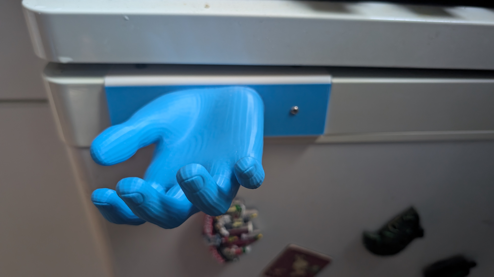

<!--
[post]
created_on = "2026-09-13"
tag = "model"
-->
# Fridge handle

[Onshape](https://cad.onshape.com/documents/a950e99e63859ebb393daa14/w/017559e61acabed13f197e71/e/5540cea906a8bc5532bdbdbe?renderMode=0&uiState=6aa6adcfe5fb009df0668345)

**Files:**
- [handle](./fridge_handle/handle.stl)
- [hand](./fridge_handle/hand.stl)

<carousel>

<model-viewer alt="Handle" src="./fridge_handle/handle.gltf" ar shadow-intensity="1" camera-controls touch-action="pan-y"></model-viewer>
<model-viewer alt="Hand" src="./fridge_handle/hand.gltf" ar shadow-intensity="1" camera-controls touch-action="pan-y"></model-viewer>
</carousel>
