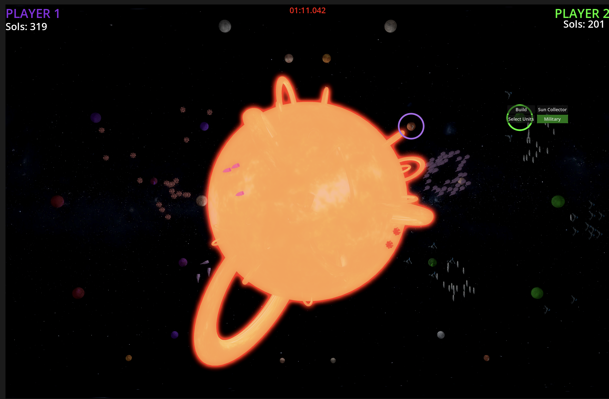

<!--
title="Now"
[post]
modified_on="2026-9-12"
-->

# What am I doing now

**Project:** Currently working on building a pen plotter dubbed *LastDraw*, a play on the NextDraw by bantam tools, it is a modified version of [Drawing Robot](https://www.thingiverse.com/thing:2349232).

**Project:** I'm working on making [Red Dwarf](./projects/red_dwarf.md) multiplayer.

**Study:** I'm going through the book [Nonlinear Dynamics and Chaos by Steven Strogatz](https://www.stevenstrogatz.com/books/nonlinear-dynamics-and-chaos-with-applications-to-physics-biology-chemistry-and-engineering) to learn about dynamic systems and differential equations.
